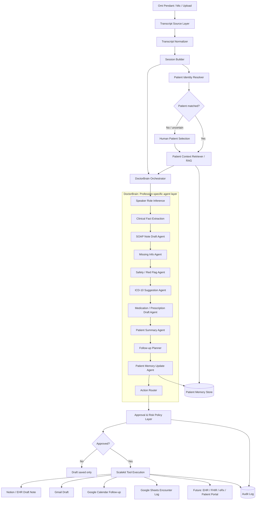
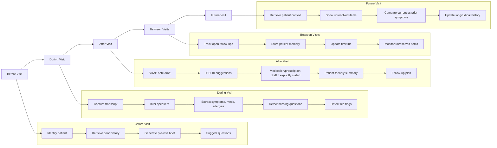
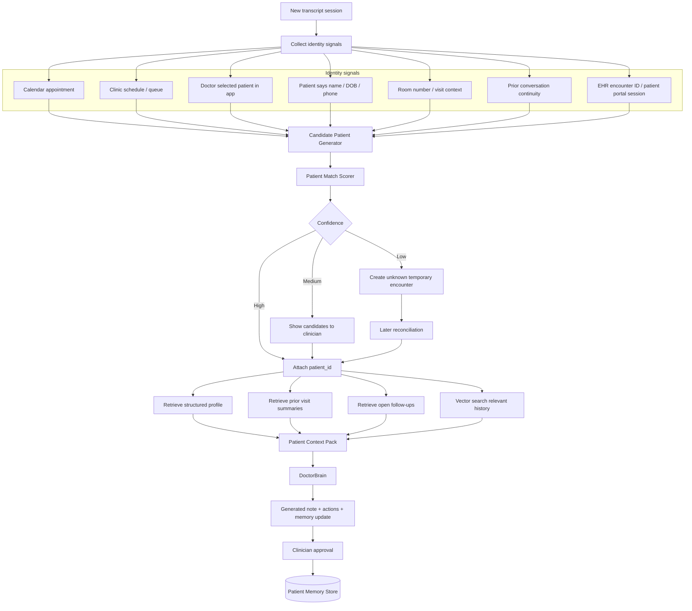

# Doctor Mode Architecture

## 1. High-level system architecture



---

## 2. Doctor journey architecture



---

## 3. Patient identity resolution + RAG flow



---

## 4. Real-world patient identity strategy

In production, never rely only on the transcript to decide who the patient is. Use a layered identity resolver.

### Priority order

1. **Explicit EHR/appointment context**
   - The doctor opens the patient chart before/during the visit.
   - The app receives `patient_id` / `encounter_id` from EHR, calendar, or scheduling system.
   - Highest confidence.

2. **Doctor-selected patient**
   - Doctor taps/selects the current patient in the companion app.
   - Good for clinics without deep EHR integration.

3. **Schedule + time window matching**
   - Current time + doctor + room + appointment calendar.
   - Example: Dr. A has John Doe at 10:30 in Room 2.

4. **Patient-introduced identifiers**
   - Name, DOB, phone, email, patient ID mentioned in conversation.
   - Needs confirmation because speech recognition can mishear names.

5. **Conversation continuity**
   - “Last time you had a sore throat” or “your diabetes meds” can narrow candidates.
   - Useful as a signal, not enough alone.

6. **Temporary unknown encounter**
   - If uncertain, create an unassigned encounter.
   - Later attach to patient after human confirmation.

---

## 5. Patient match object

```json
{
  "session_id": "visit_001",
  "match_status": "matched_high_confidence",
  "patient_id": "patient_123",
  "encounter_id": "enc_456",
  "confidence": 0.97,
  "signals": [
    {
      "type": "calendar_match",
      "value": "Appointment with Patient A at 10:30",
      "weight": 0.45
    },
    {
      "type": "doctor_selected_patient",
      "value": "patient_123",
      "weight": 0.5
    },
    {
      "type": "transcript_identifier",
      "value": "patient said first name matches appointment",
      "weight": 0.02
    }
  ],
  "requires_human_confirmation": false
}
```

---

## 6. RAG context retrieval design

Use two kinds of retrieval:

### A. Structured retrieval

Fetch known fields directly:

```text
Patient demographics
Allergies
Active medications
Problem list
Recent diagnoses
Recent visits
Open follow-ups
Pending labs
Care plans
```

Structured retrieval should come from EHR/FHIR or your patient memory DB.

### B. Semantic retrieval

Vector search over prior conversation summaries, notes, and memory items:

```text
"sore throat"
"fever"
"medication side effects"
"follow-up from last visit"
"asthma history"
```

Semantic retrieval helps find relevant history even when exact keywords differ.

---

## 7. Patient Context Pack

Before calling DoctorBrain, construct a compact context pack.

```json
{
  "patient_id": "patient_123",
  "encounter_id": "enc_456",
  "identity_confidence": 0.97,
  "demographics": {
    "age": "not available",
    "sex": "not available"
  },
  "known_allergies": [
    {
      "value": "No known drug allergies",
      "last_confirmed": "2026-06-20",
      "source": "patient stated"
    }
  ],
  "active_medications": [],
  "problem_list": [],
  "recent_visits": [
    {
      "date": "2026-06-20",
      "summary": "Reported sore throat and fever for three days.",
      "plan": "Rest, fluids, fever medication as directed, follow-up if not improving."
    }
  ],
  "open_followups": [
    {
      "due": "2026-06-23",
      "description": "Check whether fever and sore throat improved."
    }
  ],
  "retrieved_relevant_history": [
    {
      "memory_id": "mem_001",
      "text": "Patient reported mild cough with no chest pain or difficulty breathing.",
      "relevance": 0.88,
      "source_visit": "visit_001"
    }
  ]
}
```

---

## 8. Safety rules for patient identity + RAG

1. If patient identity is uncertain, do **not** write to a permanent patient record.
2. If identity confidence is medium, generate draft notes but require clinician confirmation before attaching.
3. Never use transcript-only name matching as the sole patient identity signal.
4. Every retrieved memory item must include source, date, and confidence.
5. Patient memory updates require approval when they affect durable clinical history.
6. Do not silently convert old patient-reported information into current fact; label it as last-confirmed.

---

## 9. Hackathon version

For the demo, use a simplified version:

```text
Doctor selects patient in UI
  → system gets patient_id
  → retrieve prior Notion/JSON memory
  → process transcript
  → generate SOAP + follow-up + memory update
  → write draft to Notion
```

Avoid fully automatic patient matching in the hackathon. Show the future architecture, but demo doctor-selected patient for safety and clarity.
