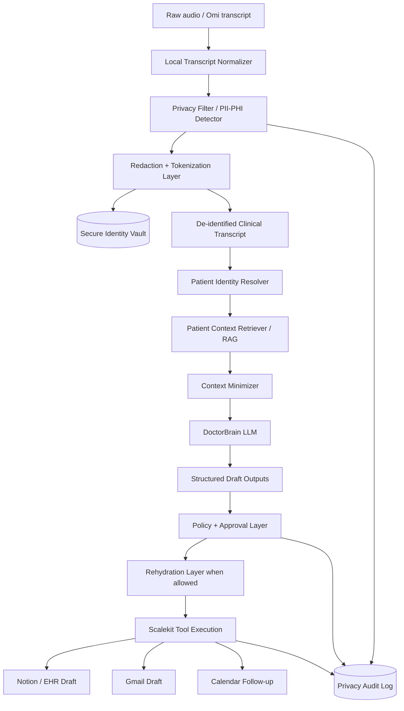

# Privacy + Compliance Layer for Doctor Mode

We plan to use [`openai/privacy-filter`](https://huggingface.co/openai/privacy-filter) as one layer in a privacy-by-design architecture.

Important: privacy filtering helps with data minimization and redaction, but it is **not** by itself a HIPAA/GDPR/DPDP compliance guarantee. It should be combined with consent, access control, audit logs, encryption, data retention policies, human review, and deployment controls.

---

## 1. Where privacy filtering sits in the architecture



---

## 2. Core idea

Do not send raw transcripts containing identifiers directly to cloud LLMs if you can avoid it.

Instead:

```text
Raw transcript
  → detect private spans
  → replace with stable placeholders
  → send de-identified transcript to DoctorBrain
  → produce structured outputs
  → rehydrate only approved fields for approved destinations
```

Example:

```text
Raw:
"My name is Ravi Sharma, DOB 12 Jan 1980, phone 98765 43210."

De-identified:
"My name is [PATIENT_NAME_1], DOB [DATE_1], phone [PHONE_1]."
```

Secure vault mapping:

```json
{
  "[PATIENT_NAME_1]": "Ravi Sharma",
  "[DATE_1]": "12 Jan 1980",
  "[PHONE_1]": "98765 43210"
}
```

---

## 3. What OpenAI Privacy Filter detects

The model card says it detects these privacy span categories:

```text
account_number
private_address
private_email
private_person
private_phone
private_url
private_date
secret
```

Useful for doctor mode:

```text
private_person   → patient/doctor names
private_phone    → phone numbers
private_email    → emails
private_address  → addresses
private_date     → DOB / appointment dates / visit dates
account_number   → possible MRN/account identifiers
secret           → keys/tokens accidentally in text
```

---

## 4. What it does not fully solve

Healthcare PHI is broader than generic PII. We should layer custom medical recognizers on top.

Additional entities to detect:

```text
medical_record_number
insurance_id
policy_number
national_id / Aadhaar / SSN
hospital_patient_id
doctor_registration_number
facility / clinic names
room / bed numbers
pharmacy identifiers
lab accession numbers
rare disease references that can identify a person in small communities
full-face image/audio references if multimodal later
```

Also, some information should not always be redacted because it is clinically important:

```text
age
symptom duration
relative dates like "three days ago"
medication dates
follow-up dates
```

So the privacy layer needs policy-aware redaction, not blind removal.

---

## 5. Redaction modes

### Mode A: Full de-identification for cloud LLM

Use when sending transcript to external LLM provider.

```text
Names → placeholders
DOB → placeholder or age bucket
Phone/email/address → placeholders
Exact dates → relative dates where possible
MRN/insurance → placeholders
```

### Mode B: Clinical-safe minimization

Use when clinical context needs some details.

```text
"DOB 12 Jan 1980" → "adult patient, exact DOB redacted"
"follow up on 23 June" → keep if needed for care plan
"fever for 3 days" → keep, not PII
```

### Mode C: No redaction / local-only processing

Use only if processing on-prem/local and authorized.

```text
Raw transcript stays inside clinic-controlled environment
LLM or smaller models run locally
No external cloud call
```

---

## 6. Placeholder design

Use stable placeholders within a session and across patient memory when appropriate.

```json
{
  "[PATIENT_NAME_1]": {
    "type": "private_person",
    "value": "Ravi Sharma",
    "scope": "session",
    "confidence": 0.99
  },
  "[DOB_1]": {
    "type": "private_date",
    "value": "1980-01-12",
    "scope": "patient_identity",
    "confidence": 0.95
  }
}
```

Stable placeholders allow DoctorBrain to reason consistently:

```text
[PATIENT_NAME_1] says he had fever.
Clinician asks [PATIENT_NAME_1] about medication allergies.
```

---

## 7. Patient identity + privacy interaction

Patient matching should happen in a controlled identity layer, not in the general LLM prompt.

```text
Raw/local transcript + schedule/EHR signals
  → identity resolver
  → patient_id
  → de-identified context pack
  → DoctorBrain
```

The LLM should usually see:

```json
{
  "patient_ref": "patient_123",
  "identity_confidence": 0.97,
  "age_band": "adult",
  "relevant_history": [...]
}
```

not:

```json
{
  "name": "Ravi Sharma",
  "dob": "12 Jan 1980",
  "phone": "98765 43210"
}
```

---

## 8. RAG with privacy

Before putting patient history into vector search:

```text
1. Split into memory items
2. Detect PII/PHI
3. Store raw value in secure vault if needed
4. Store de-identified text in vector DB
5. Store metadata: patient_id, encounter_id, date, source, sensitivity
```

Vector DB should contain de-identified clinical text:

```json
{
  "memory_id": "mem_001",
  "patient_id": "patient_123",
  "text_for_embedding": "Adult patient reported sore throat and fever for three days. Denied chest pain and difficulty breathing.",
  "source_encounter": "enc_456",
  "sensitivity": "clinical_deidentified",
  "created_at": "2026-06-20"
}
```

Raw transcript and mappings stay in restricted storage.

---

## 9. Compliance-oriented controls

For a credible healthcare story, pair privacy filtering with:

```text
Consent capture
Physical recording on/off switch
Recording indicator
Role-based access control
Encryption at rest and in transit
Audit logs for every read/write/tool action
Data retention controls
Raw audio deletion policy
Human approval before patient communication
No autonomous prescribing
Business associate / DPA story for production
On-prem or VPC deployment option
```

---

## 10. Hackathon implementation story

For the hackathon, we can say:

```text
We run a local privacy filter before sending transcripts to the DoctorBrain LLM.
The LLM sees de-identified placeholders, not raw patient identifiers.
Scalekit actions are routed through approval, and external messages are created as drafts only.
```

Demo flow:

```text
Raw transcript with name/phone/DOB
  → privacy filter highlights PII
  → de-identified transcript shown
  → DoctorBrain generates SOAP note
  → Notion draft created
  → Gmail draft created only after approval
```

---

## 11. Strong pitch line

> We are not claiming a model makes healthcare compliant. We built a privacy-by-design workflow: local PII/PHI filtering, de-identified LLM processing, source-backed clinical memory, approval-gated actions, and full auditability.
