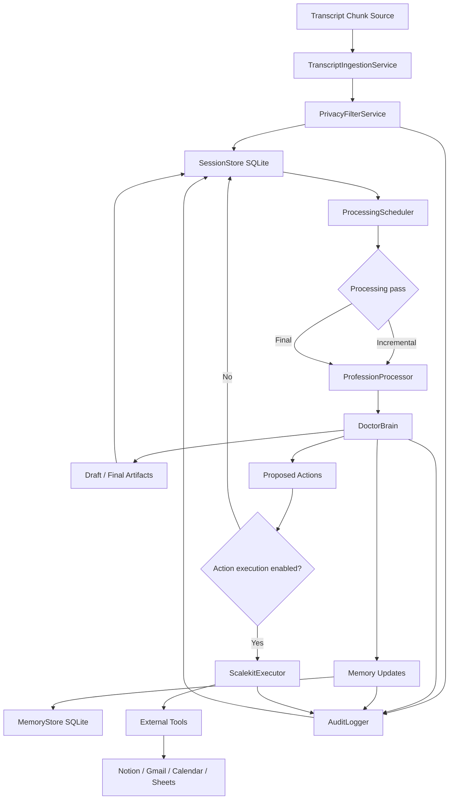

# Core System Architecture

Status: locked for MVP backend architecture

## Scope

Carry MVP is backend-only.

No frontend architecture is included in this plan. A frontend or companion app can be connected later, but the current spec focuses only on backend services, pipelines, data models, agents, storage, and integrations.

---

## Runtime shape

Carry runs as a backend system that receives streaming transcript chunks from an external source.

The transcript source may be:

```text
Omi / pendant pipeline
browser/mobile recorder service
uploaded audio transcription pipeline
simulator
third-party transcription API
```

Carry does not own the audio capture layer in the MVP. It expects transcript chunks to arrive through an API or internal function call.

---

## Core processing mode

Carry processes conversations incrementally.

The system should not wait only until the conversation ends. It should process chunks as they come in, but with a short delay/window so the system has enough context and avoids over-processing every tiny fragment.

Processing pattern:

```text
streaming transcript chunks
  → append to session buffer
  → wait/debounce for configurable interval
  → run incremental processing pass
  → update draft state
  → repeat while conversation continues
  → on conversation end, run final refinement pass
  → produce final artifacts/actions/memory updates
```

This means there are two types of processing passes:

## 1. Incremental pass

Runs during the conversation after enough new transcript has accumulated.

Purpose:

```text
keep evolving draft state
extract obvious facts
track emerging follow-ups
track open questions
track possible actions
prepare context for final pass
```

The incremental pass should produce provisional outputs only.

## 2. Final pass

Runs when the conversation is marked complete.

Purpose:

```text
re-read the full conversation
resolve contradictions
clean up artifacts
finalize structured outputs
finalize memory writes
finalize action plan
```

The final pass is the source of truth for completed outputs.

---

## Profession logic

For MVP, profession logic can be hardcoded in backend code.

Example:

```text
Doctor mode → DoctorBrain pipeline
```

However, moving parts must be config-driven through YAML files.

Config-driven items:

```text
model names
LLM base URL/provider
prompt templates
processing intervals
enabled/disabled modules
privacy filtering toggle
memory toggle/policy
action execution toggle
tool names
integration connection names
risk policy
artifact sections
```

This gives us a simple MVP while keeping the system extensible.

Future profession packs can be introduced later, but the current implementation may directly route `profession=doctor` to DoctorBrain.

---

## Pipeline order

Locked MVP pipeline:

```text
1. Receive transcript chunk
2. Attach chunk to session
3. Run privacy filter first
4. Store raw/private mappings according to privacy policy
5. Store sanitized transcript chunk
6. Wait/debounce for processing interval
7. Run incremental profession processing pass
8. Update draft session state
9. On conversation end, run final profession processing pass
10. Generate final profession-specific artifacts
11. Generate memory updates automatically
12. Generate proposed actions
13. If action execution is enabled, execute allowed actions
14. Persist audit events
```

Important: privacy filtering is the first processing step after transcript ingestion.

---

## Privacy-first ingestion

Every transcript chunk should pass through the privacy filter before being sent to any downstream LLM processing.

Conceptual flow:

```text
raw chunk
  → privacy filter
  → sanitized chunk
  → profession agent
```

If the privacy filter detects sensitive spans, Carry should produce:

```text
sanitized_text
redaction_map
privacy_labels
confidence scores
```

Example:

```json
{
  "raw_text": "My name is Ravi Sharma and my phone is 98765 43210.",
  "sanitized_text": "My name is [PRIVATE_PERSON_1] and my phone is [PRIVATE_PHONE_1].",
  "redactions": [
    {
      "placeholder": "[PRIVATE_PERSON_1]",
      "label": "private_person",
      "value": "Ravi Sharma",
      "confidence": 0.99
    },
    {
      "placeholder": "[PRIVATE_PHONE_1]",
      "label": "private_phone",
      "value": "98765 43210",
      "confidence": 0.98
    }
  ]
}
```

---

## Memory behavior

Memory updates are automatic for the MVP.

The active profession agent decides:

```text
what should be stored
what should be ignored
what should update existing memory
what should be preserved only in the session
```

For Doctor Mode, DoctorBrain can decide what patient memory items to store, such as:

```text
symptom history
follow-up plan
medication mentions
allergy statements
clinician-stated care plan
unresolved questions
```

Memory is profession-specific, not generic.

---

## Action execution behavior

Action execution is toggleable.

If action execution is disabled:

```text
Carry only produces proposed actions.
No external tools are called.
```

If action execution is enabled:

```text
Carry may execute actions through Scalekit according to profession/action policy.
```

For MVP, the exact approval/risk system is defined separately in:

```text
core/11-approval-risk-policy.md
```

But at the architecture level, all actions should be represented as structured action plans before execution.

Example:

```json
{
  "action_id": "action_001",
  "tool": "notion",
  "operation": "create_page",
  "status": "proposed",
  "payload": {}
}
```

---

## Storage layer

SQLite is the MVP storage layer.

It should store:

```text
sessions
transcript chunks
sanitized transcript chunks
privacy redaction maps
incremental draft states
final outputs
memory items
action plans
action execution results
audit events
```

SQLite is enough for hackathon/demo and keeps the backend simple.

Future production storage can move to Postgres or another managed database.

---

## Multiple sessions

Carry must support multiple sessions.

A session represents one conversation or encounter.

Examples:

```text
doctor-patient visit
founder-customer call
developer-planning discussion
lawyer-client meeting
```

Each session should have:

```text
session_id
profession
status
started_at
ended_at
transcript chunks
processing state
outputs
memory updates
action plans
```

Session statuses:

```text
created
active
processing
completed
failed
archived
```

---

## Entity concept

Carry should support an optional entity concept.

The core platform can store:

```text
entity_id
entity_type
```

But each profession defines what the entity means.

Examples:

```text
Doctor Mode → entity_type = patient
Founder Mode → entity_type = customer/company/contact
Developer Mode → entity_type = project/repository/issue
Lawyer Mode → entity_type = client/matter
```

For Doctor MVP:

```text
entity_type = patient
entity_id = patient identifier
```

This enables multiple sessions to connect to the same patient over time.

---

## Backend components

MVP components:

```text
TranscriptIngestionService
PrivacyFilterService
SessionStore
ProcessingScheduler
ProfessionProcessor
DoctorBrain
MemoryStore
ActionPlanner
ScalekitExecutor
AuditLogger
ConfigLoader
```

### TranscriptIngestionService

Receives transcript chunks and attaches them to sessions.

### PrivacyFilterService

Runs privacy filtering and produces sanitized text plus redaction metadata.

### SessionStore

Persists session state, chunks, artifacts, and processing status.

### ProcessingScheduler

Debounces streaming chunks and triggers incremental/final processing passes.

### ProfessionProcessor

Routes a session to the manually selected profession processor.

### DoctorBrain

Doctor-specific processing pipeline.

### MemoryStore

Stores profession-specific memory items.

### ActionPlanner

Converts profession outputs into proposed tool actions.

### ScalekitExecutor

Executes enabled actions through Scalekit.

### AuditLogger

Records privacy, processing, memory, and action events.

### ConfigLoader

Loads behavior from YAML config files.

---

## MVP architecture diagram



---

## Non-goals for this section

This section does not define:

```text
frontend behavior
UI approval flows
specific DoctorBrain prompts
specific clinical artifacts
specific Scalekit tool payloads
production database architecture
```

Those are handled in later spec sections.
